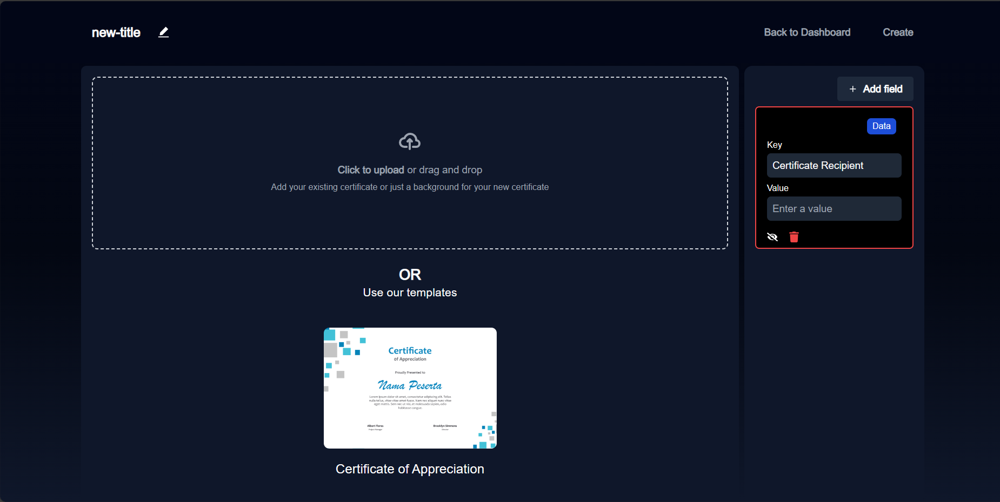
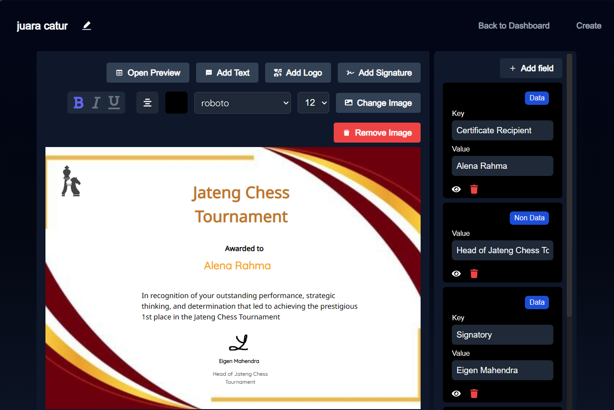
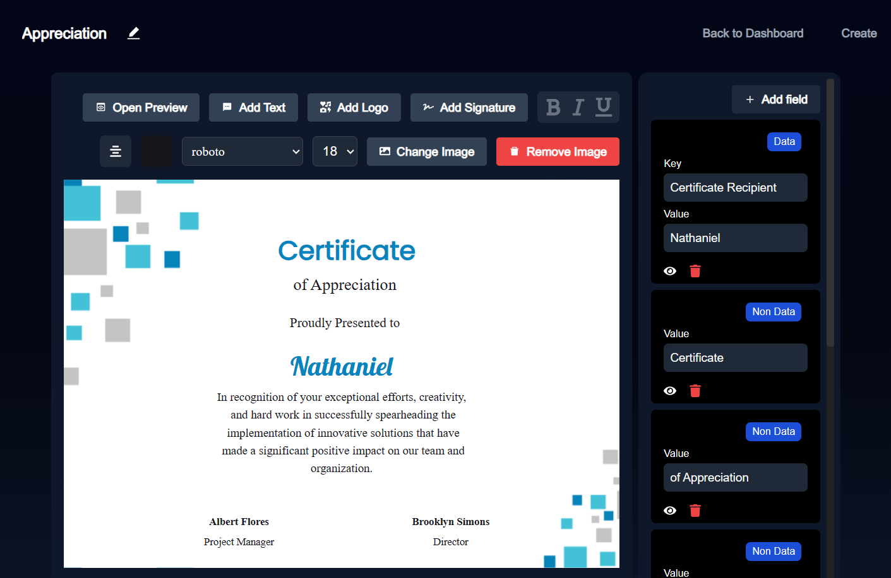
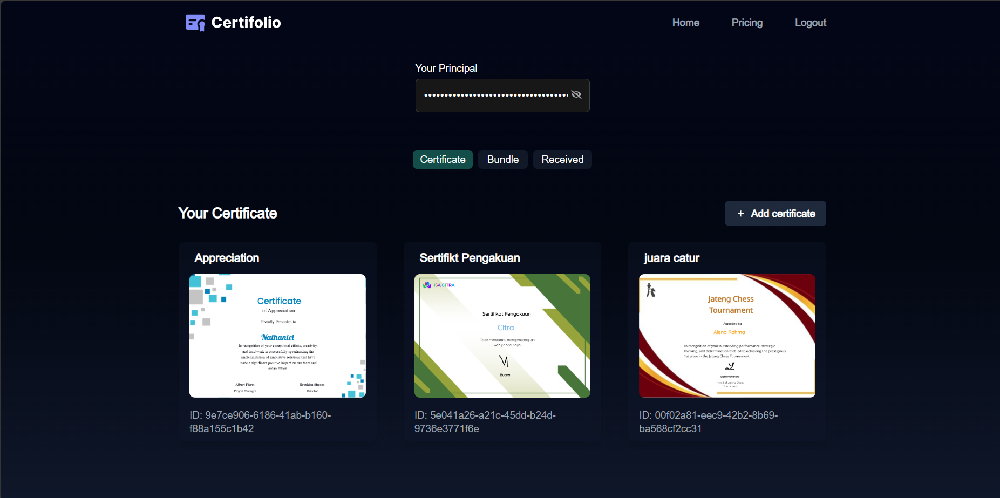
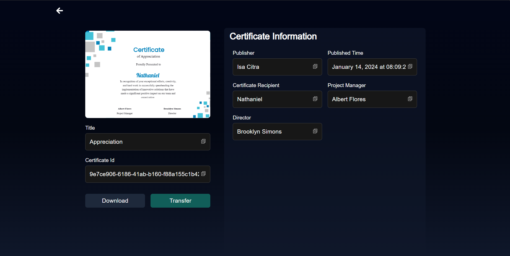
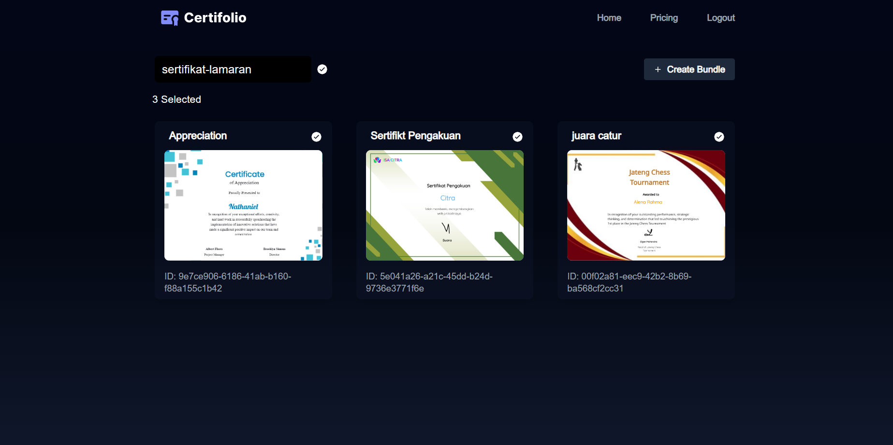
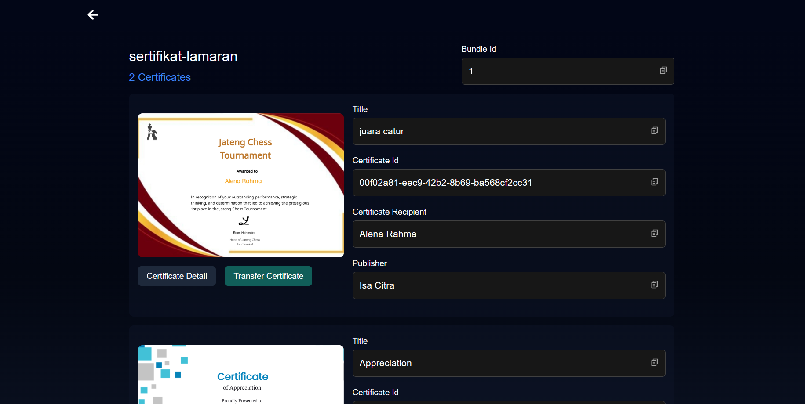
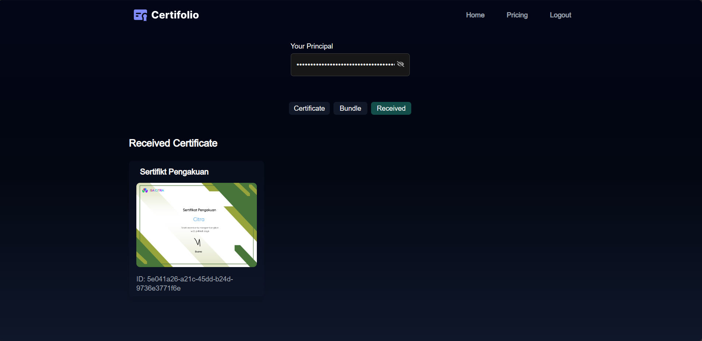
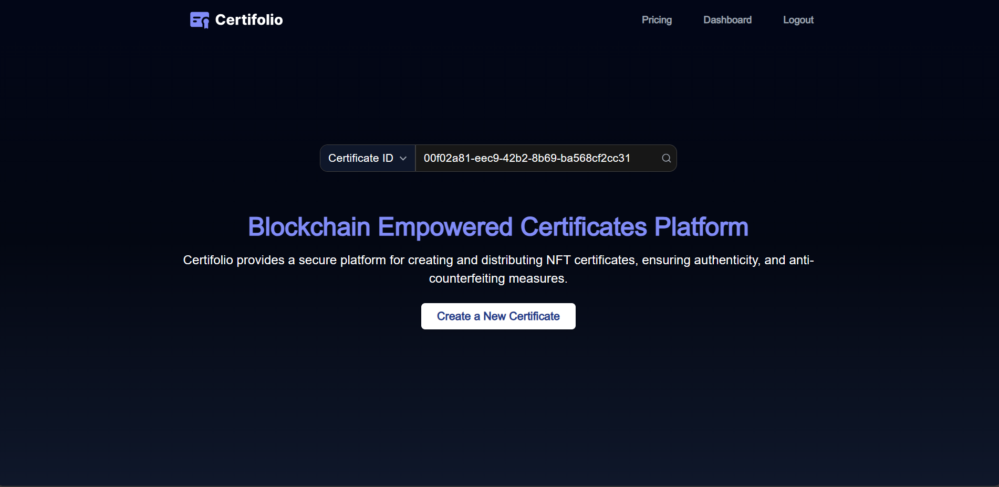
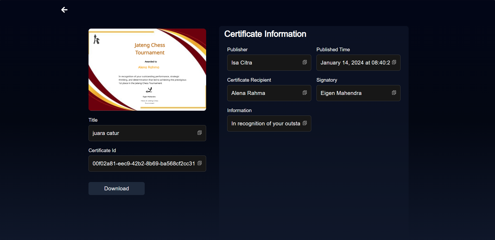

## Certifolio

Certifolio adalah platform inovatif berbasis ICP (Internet Computer Protocol) yang dirancang untuk menyediakan layanan lengkap dalam pembuatan, pengiriman, dan penyimpanan sertifikat. Dengan Certifolio, Anda dapat dengan mudah membuat dan mengelola sertifikat, baik yang dibuat di platform ini maupun platform lain, dalam lingkungan yang aman dan terverifikasi menggunakan Internet Computer Protocol. Kepastian adalah pondasi dari setiap sertifikat. Ketika seseorang atau suatu entitas menerima atau menyajikan sertifikat, kepastian atas keaslian dan integritasnya menjadi krusial. Certifolio memahami bahwa kepastian ini tidak dapat diabaikan, terutama di dunia yang semakin terhubung secara digital. Dengan demikian, Certifolio hadir dengan misi yang jelas yaitu memastikan bahwa setiap sertifikat yang tersimpan di platform ini dibuat tanpa adanya penyalahgunaan dan pemalsuan. Certifolio bertekad untuk menjadikan sertifikat sebagai bukti yang dapat diandalkan sepenuhnya.
## Getting Started
ubuntu : `bash start-app.sh` di root folder ini (certifolio)
## Built with
- NextJs
- Motoko
## Fitur Certifolio
### Pembuatan Sertifikat
#### 
#### 
#### 
Anda dapat membuat sertifikat di Certifolio baik dengan membuatnya dari awal maupun dengan menambahkan sertifikat yang sudah ada. Pembuatan sertifikat dari awal bukan menjadi masalah karena Certifolio menggunakan GUI yang interaktif dan jelas untuk mengkustomisasi pembuatan sertifikat sesuai dengan keinginan Anda. 
### Penyimpanan Sertifikat
#### 
#### 
Certifolio memungkinkan pengguna untuk menyimpan sertifikat yang mereka buat maupun yang sudah ada. Setiap sertifikat tersebut akan dibekali oleh identitas unik sehingga dapat diverifikasi keasliannya.
### Bundle Sertifikat
#### 
#### 
Pengguna dapat mengelompokkan beberapa sertifikat miliknya untuk tujuan tertentu. Sertifikat-sertifikat yang dikelompokkan tersebut dibentuk menjadi bundle sertifikat. Dengan bundle sertifikat, Certifolio memberikan kemudahan dalam manajemen dan distribusi sertifikat, meningkatkan efisiensi dan memastikan konsistensi dalam pengelolaan berbagai sertifikat untuk kepentingan pengguna.
### Transfer Sertifikat
#### 
#### 
Certifolio juga memahami bahwa pengguna juga dapat bertindak sebagai publisher yang membuat sertifikat untuk pengguna lain sehingga Certifolio memungkinkan pengguna untuk melakukan sertifikat kepada pengguna lainnya.
### Verifikasi Sertifikat
#### 
#### 
Pengguna dapat menginputkan identitas unik sertifikat maupun bundle sertifikat pada halaman home. Kemudian Certifolio akan memverfiikasi keaslian identitas tersebut. Jika identitas tersebut asli, maka pengguna akan di-redirect ke halaman sertifikat maupun bundle sertifikat yang terkait.

## Potensi Pengembangan Lebih Lanjut
### Diversifikasi Produk
Produk pada Certifolio dapat ditingkatkan yang tidak hanya mencakup sertifikat, tetapi juga memungkinkan pengguna untuk menyimpan, mentransfer, dan memverifikasi dokumen lain. Dengan inklusi ini, Certifolio dapat menjadi pusat manajemen dokumen yang aman dan terverifikasi, memperluas fungsionalitasnya untuk mendukung berbagai jenis informasi yang memerlukan validasi keaslian. 
### Integrasi AI dalam Verifikasi Sertifikat
Salah satu potensi pengembangan yang menarik adalah integrasi kecerdasan buatan (AI) untuk verifikasi otomatis keaslian sertifikat, khususnya jika sertifikat tersebut sudah pernah diterbitkan di platform lain. Melalui implementasi AI, Certifolio dapat memanfaatkan teknologi pengenalan pola dan analisis perbandingan untuk secara otomatis memverifikasi keabsahan setiap sertifikat yang diunggah, bahkan jika sertifikat tersebut berasal dari sumber eksternal. Dengan demikian, Certifolio tidak hanya menjadi platform manajemen dokumen, tetapi juga menjadi alat validasi yang cerdas, membantu memastikan integritas dan keaslian setiap sertifikat dengan lebih efisien dan akurat.
### Verifikasi Keabsahan Pengguna
Certifolio memiliki peluang untuk memperluas proses verifikasi pengguna dengan mengintegrasikan kecerdasan buatan (AI) dan Nomor Induk Berusaha (NIB) sebagai data identifikasi. Dengan memanfaatkan informasi yang terkandung dalam NIB, Certifolio dapat meningkatkan keakuratan dan keamanan verifikasi identitas, memastikan bahwa setiap pengguna yang terdaftar adalah entitas yang sah dan terkait dengan perusahaan yang benar. Integrasi NIB dengan teknologi AI ini bukan hanya memperkuat lapisan keamanan, tetapi juga memfasilitasi penggunaan Certifolio dalam lingkungan bisnis dengan memberikan validasi identitas yang lebih kuat dan akurat.
